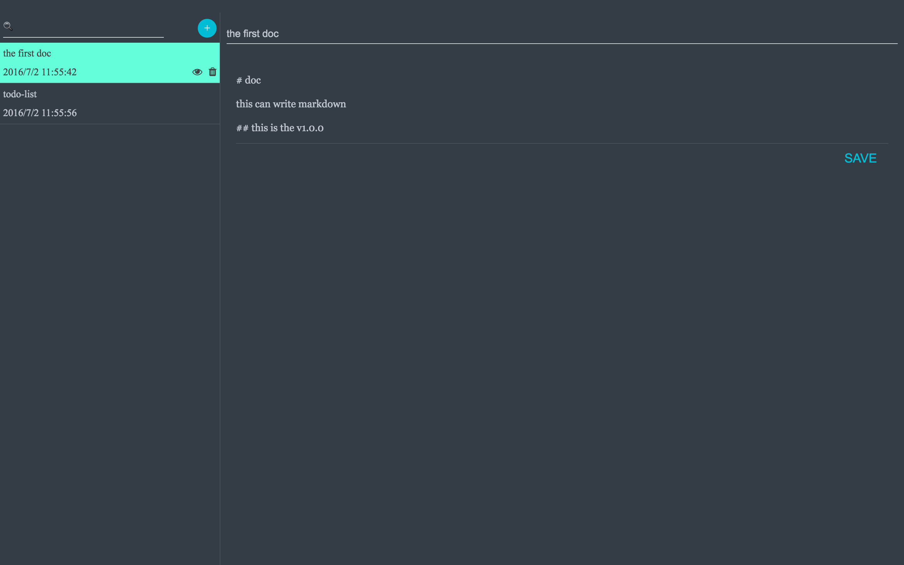
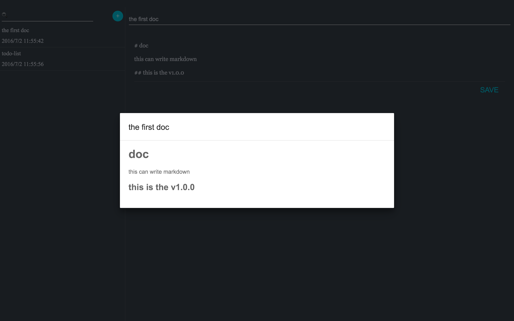

# Awesome-Note
this is the note desktop APP. It is more convenient and beautiful.(chinese markdown see `README_ZH.md`)

 
 

## Function

The note can write markdown, and save in your component.

## Introduction

This desktop app use `electron + react + redux`.

## Use

How to use this app?

    git clone
    cd note
    npm run build

How to develop this app?

    git clone
    cd note
    npm run dev
    npm run start
